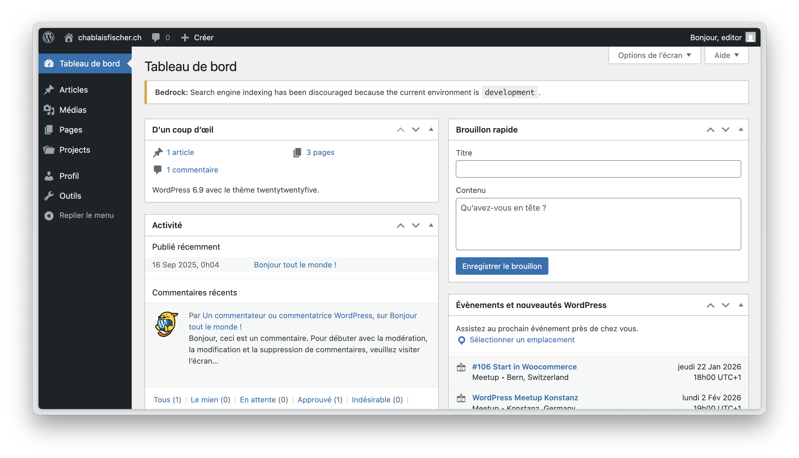
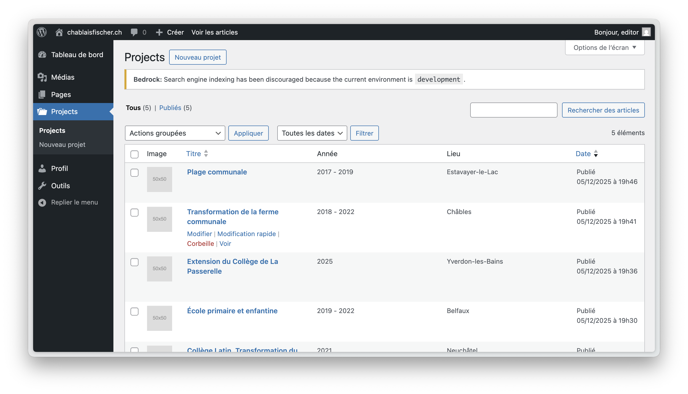
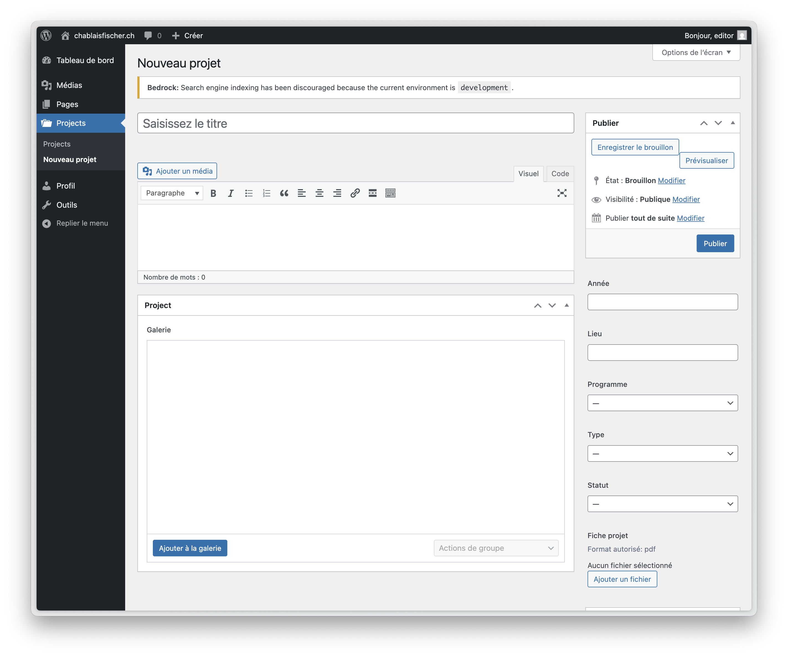
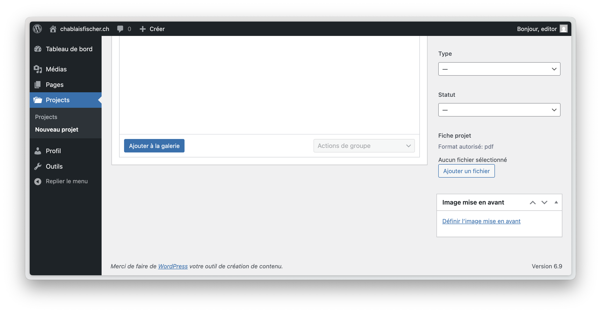
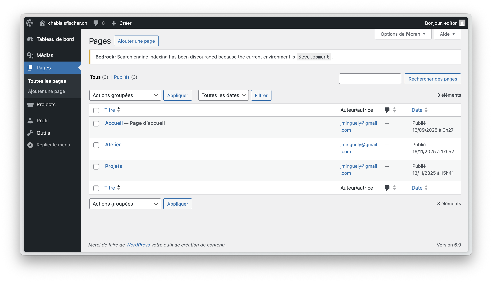
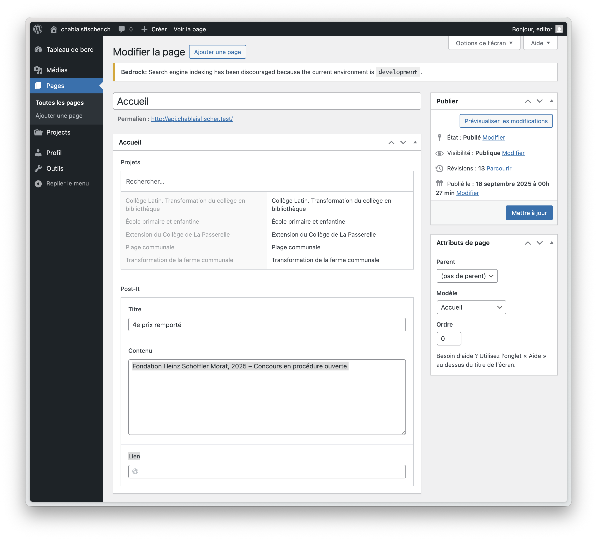
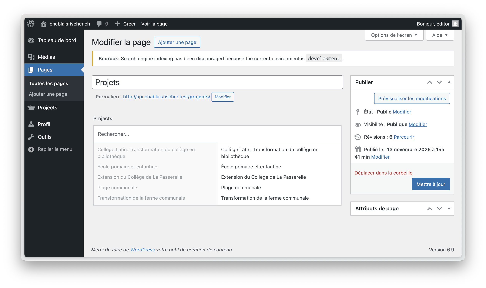
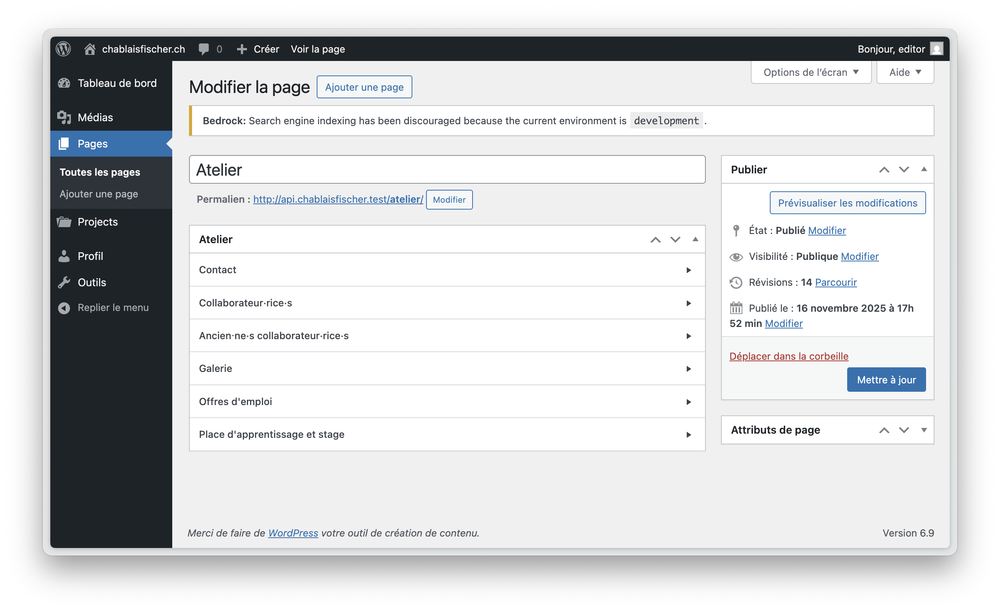

# Guide Utilisateur - Chablais Fischer Architectes

**Guide d'utilisation de l'administration WordPress**

---

## Table des matières

1. [Connexion à l'administration](#1-connexion-à-ladministration)
2. [Tableau de bord](#2-tableau-de-bord)
3. [Gérer les projets](#3-gérer-les-projets)
4. [Gérer les pages](#4-gérer-les-pages)
   - [Page d'accueil](#page-daccueil)
   - [Page Projets](#page-projets)
   - [Page Atelier](#page-atelier)
5. [Bibliothèque de médias](#5-bibliothèque-de-médias)
6. [Bonnes pratiques](#6-bonnes-pratiques)

---

## 1. Connexion à l'administration

Pour accéder à l'interface d'administration de votre site :

1. Rendez-vous à l'adresse : **https://api-cf.mingus.space/wp/wp-admin**
2. Entrez vos identifiants (nom d'utilisateur et mot de passe)
3. Cliquez sur **Se connecter**

> 💡 **Astuce** : Pensez à enregistrer cette page dans vos favoris pour un accès rapide.

---

## 2. Tableau de bord

Une fois connecté, vous arrivez sur le **Tableau de bord** de WordPress.

Le menu de gauche vous permet d'accéder aux différentes sections :

- **Projets** : Gérer vos projets d'architecture
- **Pages** : Modifier les pages du site (Accueil, Atelier, Projets)
- **Images** : Accéder à la bibliothèque de médias (photos, PDFs)

---

## 3. Gérer les projets

Les projets sont le contenu principal du site. Ils apparaissent dans plusieurs endroits : page d'accueil (slider), page projets (grille), et liste complète (index).

### Voir la liste des projets

1. Cliquez sur **Projets** dans le menu de gauche
2. Vous verrez la liste de tous vos projets avec :
   - Une image miniature
   - Le titre du projet
   - L'année
   - Le lieu

### Créer un nouveau projet

1. Cliquez sur **Projets** → **Ajouter**

2. **Remplissez les informations principales** :

   **Titre du projet** (obligatoire)
   - Exemple : "Villa Minergie à Vevey"

3. **Ajoutez une image à la une** (obligatoire)
   - Dans la colonne de droite, cliquez sur **Définir l'image à la une**
   - Téléchargez une nouvelle image ou choisissez-en une existante
   - Cette image apparaîtra dans la liste des projets et dans les prévisualisations

4. **Remplissez les informations du projet** (dans la colonne de droite) :

   **Année**
   - Format recommandé : "2023" ou "2022-2024"
   
   **Lieu**
   - Exemple : "Vevey" ou "Vevey, VD"
   
   **Programme**
   - Sélectionnez le type de projet :
     - Logement
     - Culture
     - Urbanisme
     - Loisirs
     - Éducation
     - Garage
   
   **Type**
   - Privé ou Public
   
   **Statut**
   - En travaux
     - Construit
     - Lauréat
     - 2e prix / 3e prix / 4e prix

   **Fiche projet** (optionnel)
   - Vous pouvez télécharger un PDF contenant les détails du projet

5. **Ajoutez une galerie d'images** (optionnel mais recommandé) :

   - Descendez dans la page principale
   - Section **Galerie**
   - Cliquez sur **Ajouter à la galerie**
   - Sélectionnez plusieurs images (maintenez Ctrl/Cmd enfoncé)
   - Cliquez sur **Ajouter à la galerie**
   
   > ⚠️ **Important** : Sans galerie d'images, le projet n'est **pas cliquable** dans la liste index. Les utilisateurs ne pourront pas voir plus de détails.

6. **Publiez le projet** :
   - Cliquez sur **Publier** dans la colonne de droite
   - Le projet apparaît immédiatement sur le site

### Modifier un projet existant

1. Cliquez sur **Projets**
2. Cliquez sur le titre du projet à modifier
3. Effectuez vos modifications
4. Cliquez sur **Mettre à jour**

### Supprimer un projet

1. Passez la souris sur le projet dans la liste
2. Cliquez sur **Mettre à la corbeille**
3. Le projet est déplacé dans la corbeille (récupérable pendant 30 jours)

---

## 4. Gérer les pages

Le site comporte trois pages principales que vous pouvez modifier.

### Accéder aux pages

1. Cliquez sur **Pages** dans le menu de gauche

Vous verrez trois pages :
- **Accueil** (/)
- **Atelier** (/atelier)
- **Projets** (/projets)

---

### Page d'accueil

La page d'accueil affiche un **slider d'images** avec des projets sélectionnés et un **post-it** avec une annonce.

**Pour modifier la page d'accueil** :

1. Cliquez sur **Pages** → **Accueil**
2. Vous verrez deux sections :

#### Section "Projets"

Cette section permet de choisir quels projets apparaissent dans le slider de la page d'accueil.

**Pour ajouter/modifier les projets** :
- Cliquez dans le champ **Projets**
- Une liste de vos projets apparaît
- Cliquez sur un projet pour l'ajouter
- Vous pouvez sélectionner plusieurs projets (5-10 recommandés)
- Pour retirer un projet, cliquez sur le **×** à côté de son nom
- Vous pouvez **réorganiser l'ordre** en glissant-déposant les projets

> 💡 **Astuce** : Choisissez des projets avec de belles images à la une pour un slider attractif.

#### Section "Post-It"

Le post-it est une petite note qui apparaît sur la page d'accueil (par exemple pour une annonce).

**Champs disponibles** :
- **Titre** : Titre court du post-it (exemple : "Nouveau projet")
- **Contenu** : Texte de l'annonce (2-3 lignes maximum)
- **Lien** : URL vers laquelle pointer (optionnel)

**Pour activer/désactiver le post-it** :
- Si vous laissez le titre et le contenu vides, le post-it n'apparaîtra pas
- Pour le réactiver, remplissez au moins le titre et le contenu

3. **Cliquez sur Mettre à jour** pour sauvegarder vos modifications

---

### Page Projets

La page Projets affiche une **grille de projets sélectionnés** avec une mise en page créative (disposition aléatoire).

**Pour modifier la page Projets** :

1. Cliquez sur **Pages** → **Projets**
2. Vous verrez une section **Projects**

#### Section "Projects"

Sélectionnez les projets qui apparaîtront sur la page Projets en grille.

**Pour ajouter/modifier les projets** :
- Cliquez dans le champ **Projects**
- Sélectionnez les projets que vous souhaitez afficher
- L'ordre n'a pas d'importance (la disposition est aléatoire sur le site)
- Recommandation : 8-15 projets pour un bon rendu

> 💡 **Astuce** : Sélectionnez des projets variés pour montrer l'étendue de votre travail.

3. **Cliquez sur Mettre à jour** pour sauvegarder

---

### Page Atelier

La page Atelier présente votre équipe, vos coordonnées et les offres d'emploi.

**Pour modifier la page Atelier** :

1. Cliquez sur **Pages** → **Atelier**
2. Vous verrez plusieurs sections :

#### Informations de contact

- **Adresse** : Adresse complète du bureau
- **Téléphone** : Numéro de téléphone
- **E-Mail** : Adresse email de contact
- **Instagram** : Lien vers votre compte Instagram

#### Collaborateurs actuels

Section pour présenter les membres actuels de l'équipe.

**Pour ajouter un collaborateur** :
1. Cliquez sur **Ajouter une ligne**
2. Remplissez les informations :
   - **Nom** : Prénom et nom
   - **Rôle** : Fonction dans l'agence (Architecte, Dessinateur, etc.)
   - **Image** : Photo du collaborateur
   - **Has Modal** : Cochez si vous voulez une fenêtre détaillée au clic
   - **Description** : Texte de présentation (si modal activé)
   - **CV** : Parcours professionnel (répéteur, plusieurs lignes possibles)
     - **Dates** : Période (exemple : "2020-2023")
     - **Description** : Poste et entreprise

**Pour réorganiser les collaborateurs** :
- Glissez-déposez les lignes pour changer l'ordre

**Pour supprimer un collaborateur** :
- Cliquez sur l'icône **−** (moins) à droite de la ligne

#### Anciens collaborateurs

Même fonctionnement que les collaborateurs actuels, pour garder une trace de votre équipe passée.

#### Galerie

Ajoutez des photos de votre bureau ou de vos projets.

**Pour ajouter des images** :
1. Cliquez sur **Ajouter une ligne**
2. Cliquez sur **Image**
3. Sélectionnez une image depuis votre bibliothèque ou téléchargez-en une nouvelle

#### Offres d'emploi

Section pour publier vos offres d'emploi.

**Pour ajouter une offre** :
1. Cliquez sur **Ajouter une ligne**
2. Remplissez :
   - **Titre** : Intitulé du poste (exemple : "Architecte Junior")
   - **Date** : Date de publication ou date limite
   - **Fichier** : PDF avec les détails de l'offre

**Texte Offres Emploi** : Texte d'introduction au-dessus des offres

#### Places d'apprentissage

Même principe que les offres d'emploi, mais pour les apprentis.

**Texte Apprentissage** : Texte d'introduction pour la section apprentissage

3. **Cliquez sur Mettre à jour** pour sauvegarder toutes vos modifications

---

## 5. Bibliothèque de médias

La bibliothèque de médias (Images) stocke toutes vos photos et fichiers PDF.

### Accéder à la bibliothèque

1. Cliquez sur **Images** dans le menu de gauche
2. Vous voyez toutes vos images et fichiers

### Télécharger de nouvelles images

1. Cliquez sur **Ajouter**
2. **Glissez-déposez** vos fichiers ou cliquez sur **Sélectionner des fichiers**
3. Sélectionnez une ou plusieurs images sur votre ordinateur
4. Les images sont automatiquement téléchargées

> 💡 **Formats acceptés** : JPG, PNG, WebP, SVG (pour les images), PDF (pour les documents)

### Modifier une image

1. Cliquez sur l'image dans la bibliothèque
2. Vous pouvez modifier :
   - **Texte alternatif** : Description de l'image (important pour l'accessibilité)
   - **Titre** : Nom de l'image
   - **Légende** : Texte sous l'image
   - **Description** : Description détaillée

> ⚠️ **Important** : Remplissez toujours le **Texte alternatif** avec une description claire de l'image (exemple : "Vue extérieure de la Villa Minergie à Vevey").

### Supprimer une image

1. Cliquez sur l'image
2. Cliquez sur **Supprimer définitivement**
3. Confirmez la suppression

> ⚠️ **Attention** : Si une image est utilisée dans un projet, elle sera supprimée partout.

---

## 6. Bonnes pratiques

### Images

**Taille et qualité** :
- Largeur recommandée : **2000 pixels maximum**
- Privilégiez la qualité : les images floues ou pixelisées nuisent au rendu
- Optimisez vos images avant de les télécharger (utilisez un outil de compression)

**Nommage** :
- Donnez des noms clairs à vos fichiers : `villa-vevey-facade.jpg` plutôt que `IMG_1234.jpg`
- Évitez les accents et caractères spéciaux dans les noms de fichiers

**Organisation** :
- Ajoutez toujours un **texte alternatif** descriptif
- Pensez à supprimer les images inutilisées pour économiser de l'espace

### Projets

**Informations essentielles** :
- Titre clair et descriptif
- Image à la une de qualité
- Au moins l'année et le lieu renseignés

**Galerie d'images** :
- **5 à 15 images** par projet recommandé
- Variez les vues : extérieurs, intérieurs, détails
- Ordre logique : commencez par les vues générales, puis les détails
- Sans galerie, le projet n'est pas cliquable dans l'index

**Cohérence** :
- Utilisez le même format pour les années (ex: toujours "2023" ou toujours "2023-2024")
- Soyez cohérent dans les noms de lieux (ex: "Vevey" ou "Vevey, VD")

### Pages

**Page d'accueil** :
- Changez régulièrement les projets du slider pour dynamiser la page
- Le post-it est utile pour des annonces temporaires (événements, nouvelles, etc.)

**Page Projets** :
- Sélectionnez vos meilleurs projets récents
- Mettez à jour régulièrement pour refléter votre travail actuel

**Page Atelier** :
- Maintenez l'équipe à jour
- Pensez à déplacer les anciens collaborateurs dans la section appropriée
- Retirez les offres d'emploi pourvues

### Sauvegardes

**Avant de grandes modifications** :
- Prenez note de l'état actuel (faites des captures d'écran si nécessaire)
- Les modifications sont réversibles : vous pouvez toujours revenir en arrière

**Publication** :
- Cliquez toujours sur **Mettre à jour** ou **Publier** pour sauvegarder vos modifications
- Les brouillons sont sauvegardés automatiquement, mais pas visibles sur le site

---

## Questions fréquentes

**Q : Combien de temps faut-il pour que mes modifications apparaissent sur le site ?**  
R : Les modifications sont **immédiates** dès que vous cliquez sur "Mettre à jour" ou "Publier".

**Q : Puis-je prévisualiser mes modifications avant de les publier ?**  
R : Oui, cliquez sur le bouton **Prévisualiser** avant de publier. Cela ouvre un nouvel onglet avec votre page modifiée (visible uniquement par vous).

**Q : Que faire si je fais une erreur ?**  
R : WordPress conserve un historique des modifications. En cas de problème, contactez votre administrateur qui pourra restaurer une version précédente.

**Q : Puis-je ajouter des vidéos ?**  
R : Le système actuel ne gère pas directement les vidéos. Pour intégrer des vidéos, contactez votre administrateur.

**Q : Les projets doivent-ils obligatoirement avoir une galerie ?**  
R : Non, mais **sans galerie, le projet ne sera pas cliquable** dans la liste index. Les visiteurs ne pourront voir que les informations de base (titre, année, lieu, etc.).

**Q : Puis-je modifier plusieurs projets en même temps ?**  
R : Non, vous devez modifier chaque projet individuellement. Cependant, vous pouvez ouvrir plusieurs onglets pour travailler sur plusieurs projets simultanément.

**Q : Comment organiser l'ordre des projets sur le site ?**  
R : L'ordre est automatique et ne peut pas être modifié manuellement :
- **Page d'accueil (slider)** : Ordre que vous définissez dans la sélection
- **Page Projets (grille)** : Disposition aléatoire créative
- **Index (liste)** : Tri par date de création (plus récents en premier) ou personnalisable par le visiteur

**Q : Les images sont-elles automatiquement redimensionnées ?**  
R : Oui, WordPress génère automatiquement plusieurs tailles pour chaque image uploadée. Néanmoins, téléchargez des images de bonne qualité (largeur recommandée : 2000px).

---

## Besoin d'aide ?

Si vous rencontrez un problème ou avez une question qui n'est pas couverte par ce guide, n'hésitez pas à contacter votre administrateur technique.

**Informations importantes à fournir en cas de problème** :
- Votre nom d'utilisateur
- La page ou le projet concerné
- Une description précise du problème
- Idéalement, une capture d'écran

---

**Dernière mise à jour** : Janvier 2026  
**Version** : 1.0
